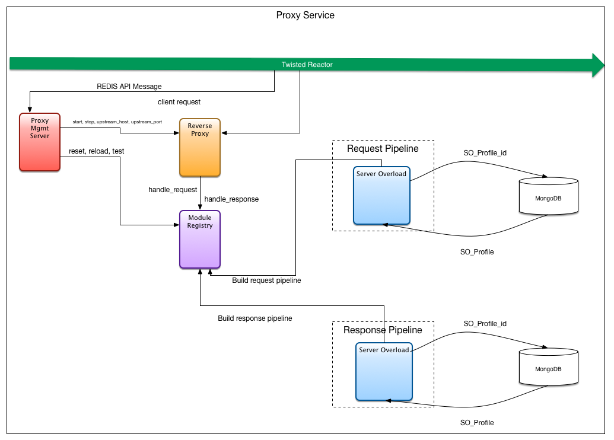

- [Server Overload Module](#server-overload-module)
  - [exponential overload](#exponential-overload)
  - [DoS](#DoS)
  - [servoer overload Profile](#server-overload-profile)
  - [Metrics](#metric-collection)

# Server Overload Module

  

The server overload module is situated inside the proxy processing pipline and as traffic is ingested by the proxy service a pre-defined server overload profile is applied.
When started a given `session_id` is used to retrieve the server overload profile from `mongo` and .
As traffic is ingested by the proxy service the server overload module will simulate the traffic overload pattern as defined by the retrieved server overload profile.
Then for any given request the current traffic pattern is summarized by a scalar value in the range of 1 - 100 that represents the current server load.
This server load value is then used to determine the proxy service response.
Both the parameter values used to simulate the traffic ultimatly resulting in a server load and what response should be sent given the server load are defined by the server overload profile.

## Server Overload Profile

 The server overload profile is stored in the `mongo` database and associated with a given session. Its primary purpose is to define the specific type and intensity of overload to be applied as well as how the proxy should respond at any given request.
The server overload profile is retrieved from information contained within the session document. The following is an example session document, note specficlially the `serverOverload.id`.
The `serverOverload.id` is used to retrieve the server overload profile from mongo.

### Example session document
```json
{
  "id": 1,
  "name": "Session A",
  "description": "This is a description for a Session",
  "upstreamHost": "github.com",
  "upstreamPort": 80,
  "createdAt": "2014-02-12 03:34:51",
  "updatedAt": "2014-02-12 03:34:51",
  "testPlan":
  {
    "id": 12,
    "name": "ViPR Test plan"
  },
  "qos":
  {
    "id": 45
  },
  "serverOverload":
  {
    "id": 951
  },
  "user":
  {
    "id": 1,
    "username": "John Doe"
  },
  "executions": 42,
}
```

The server overload profile has four primary components used to determine the type the simulated load and associated responses. Those components, or `keys` are as follows:

| Key                    | Description                                             |
|:-----------------------|:--------------------------------------------------------|
| name                   | The name of the profile                  |
| description            | A description of the profile               |
| function               | The function inputs to be used when simulating the server load. Current function types include: `exponential` and `plateau`|
| response_triggers      | The server load to response mapping|


The following is an example server overload profile, note the four main keys defined above.

### Example server overload profile

```json
{
    "name": "Raspberry PI Overload profile",
    "description": "bla bla...",
    "function": {
        "type": "exponential",
        "expValue": "3",
        "growthRate": "3"
    },
    "response_triggers": [
        {
            "fromLoad": 70,
            "toLoad": 80,
            "actions": [
                {
                    "type": "response",
                    "value": "503",
                    "percentage": 30
                },
                {
                    "type": "delay",
                    "value": "300",
                    "percentage": 100
                }
            ]
        },
        {
            "fromLoad": 80,
            "toLoad": null,
            "actions": [
                {
                    "type": "response",
                    "value": "503",
                    "percentage": 100
                }
            ]
        }
    ]
}
```
## Functions
The following possible function types are implemented as command objects and executed with the parameters given by the server overload profile:

| Funtion    | Context | Description                                             |
|:-----------|:--------|:--------------------------------------------------------|
| exponetial | request | An exponential increase in server load                  |
| Plateau    | request | An overload that has a maximum "pressure"               |

### Exponential

A function type of `exponential` is meant to simulate server overload that grows exponentially. The `exponential` function type has the following parameters.

| Parameter        | Context | Description                                  |
|:-----------------|:--------|:---------------------------------------------|
| expValue         | request | The exponent used in the increase in load.   |
| growthRate       | request | The rate in `requests` the load should exponentially grow. In other words, after how many requests should the load again grow|
| maxRequests      | request | The maximum number of `requests` allowed, zero indicates infinite |
| maxLoad          | request | The maximum server load that will be returned, zero indicates infinite |
| fluxuation       | request | The sine angle to be used in fluxuating the load. Zero of course is no fluxuation |

### Plateau

An funtion type of `plateau` is meant to simulate server overload that starts after some period time and then linearly grows to a maximum load. The `plateau` type function has the following parameters.

| Parameter        | Context | Description                                  |
|:-----------------|:--------|:---------------------------------------------|
| requestStart     | request | Server load will grow after `requestStart` requests have been received |
| growthRate       | request | The rate in `requests` the load should linearly grow. In other words, after how many requests should the load again grow|
| growthAmount     | request | The number of `requests` the load will grow |
| fluxuation       | request | The sine angle to be used in fluxuating the load. Zero of course is no fluxuation |

## Response Triggers
Response triggers are meant to provide the end user a mechanism for emulating server response under load. The server overload profile allows for any number of triggers to be defined. Each trigger is essentially a load threshold to response mapping. The `response_triggers` keys are defined as follows:

| Key                    | Description                                             |
|:-----------------------|:--------------------------------------------------------|
| fromLoad               | The bottom end of the trigger threshold                 |
| toLoad                 | The top end of the trigger threshold                    |
| actions                | A list of actions and parameters |
| actions["type"]        | The action type |
| actions["value"]       | The value of the action |
| actions["percentage"]  | The chance the action will be applied |

# Metric Collection

The Server Overload module will continuously update a set of metrics that may be useful in future analysis of the injection session. Each metrics is available in real-time by making the module `status` API call. The following metrics are collected:

| metric      | Description                                             |
|:------------|:--------------------------------------------------------|
| load      | The current amount load being injected              |
| requests  | The current total number of requests that have processd |
| responses | The current count of each response type  |
